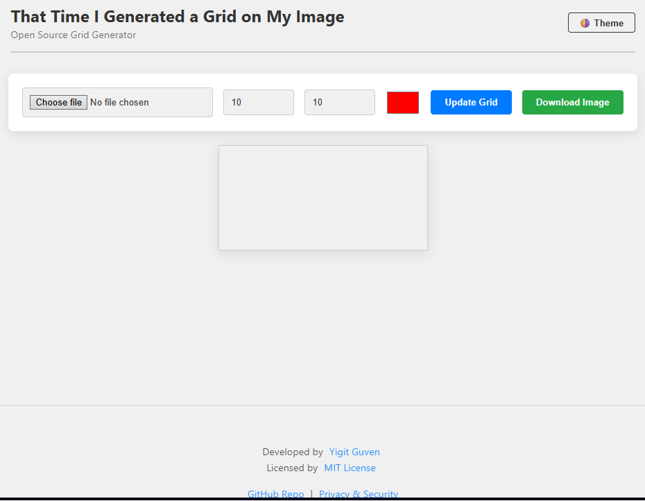
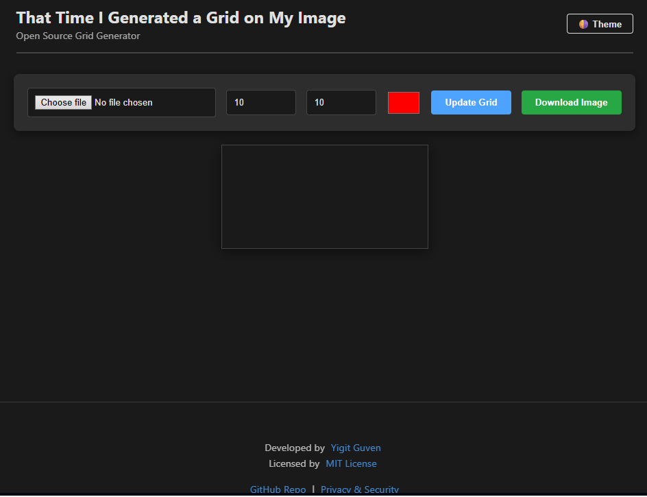

# That Time I Generated a Grid on My Image


**A blazing-fast, privacy-focused tool for overlaying customizable grids on images directly in your browser.**

---

## 📖 Overview

**That Time I Generated a Grid on My Image** is a lightweight, client-side utility designed for artists, developers, and designers who need pixel-perfect reference grids.

Unlike other tools that require server uploads or heavy software installations, this application runs entirely within your web browser using the **HTML5 Canvas API**. This ensures zero latency and guarantees that your images never leave your device.

### ✨ Key Features

* **🚀 Instant Processing:** Powered by vanilla JavaScript and HTML5 Canvas for real-time rendering.
* **🔒 Privacy-First Architecture:** 100% client-side execution. Your photos are processed in memory and never uploaded to a server.
* **🎨 Fully Customizable:**
    * Adjust **Rows (Y)** and **Columns (X)** dynamically.
    * Native **Color Picker** to ensure grid visibility against any background.
* **🌗 Adaptive Theming:** Persistent **Dark/Light mode** that respects your system preferences and saves your choice.
* **💾 High-Quality Export:** Download your gridded images instantly in PNG format.
* **📱 Responsive Design:** optimized for desktops, tablets, and mobile devices.

---

## 🛠️ Tech Stack

This project is built with a focus on performance, simplicity, and modern web standards.

| Component | Technology | Description |
| :--- | :--- | :--- |
| **Core Logic** | Vanilla JavaScript | Canvas API for high-performance image manipulation. |
| **Structure** | HTML5 | Semantic markup for accessibility and structure. |
| **Styling** | CSS3 Variables | Dynamic theming engine for Dark/Light mode support. |
| **Desktop** | Electron (Optional) | Can be wrapped for native desktop deployment. |

---

## 🚀 Getting Started

You can use the application directly via the web or run it locally.

### 🌐 Live Demo
**[Launch the App](https://yigit-guven.github.io/That-Time-I-Generated-a-Grid-on-My-Image/)**

### 💻 Local Installation

1.  **Clone the repository**
    ```bash
    git clone https://github.com/yigit-guven/That-Time-I-Generated-a-Grid-on-My-Image.git
    ```
2.  **Navigate to the project directory**
    ```bash
    cd That-Time-I-Generated-a-Grid-on-My-Image
    ```
3.  **Run the App**
    * Simply open `index.html` in any modern web browser.

---

## 📦 Building for Desktop (Electron)

To run this as a standalone native application on Windows, macOS, or Linux:

1.  **Install Dependencies** (Requires Node.js)
    ```bash
    npm install
    ```
2.  **Start Development Mode**
    ```bash
    npm start
    ```
3.  **Build Executable**
    ```bash
    npm run pack
    ```

---

## 📸 Screenshots

| Light Mode | Dark Mode |
| :---: | :---: |
|  |  |

---

## 🛡️ Privacy & Security

We take privacy seriously.

* **Zero Data Collection:** We do not track users, cookies, or analytics.
* **Local Execution:** All image processing is sandboxed within your browser session.

For more details, please refer to our [Security Policy](SECURITY.md).

---

## 🤝 Contributing

Contributions are welcome! If you have ideas for new features or bug fixes:

1.  Fork the repository.
2.  Create your feature branch (`git checkout -b feature/AmazingFeature`).
3.  Commit your changes (`git commit -m 'Add some AmazingFeature'`).
4.  Push to the branch (`git push origin feature/AmazingFeature`).
5.  Open a Pull Request.

---

## 📄 License

Distributed under the MIT License. See [`LICENSE`](https://github.com/yigit-guven/That-Time-I-Generated-a-Grid-on-My-Image/blob/main/LICENSE) for more information.

---

<div align="center">
  <p>Developed with ❤️ by <a href="https://github.com/yigit-guven">Yigit Guven</a></p>
</div>